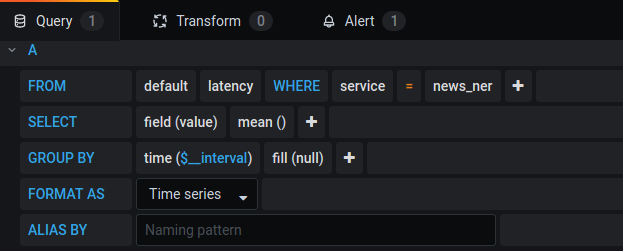

I have not found a good introduction on writing data into Grafana and InfluxDB with http, so I write my own.

First you need to create the database.

```
        r = requests.post(
            "http://localhost:8086/query",
            params={"q": "CREATE DATABASE {}".format(db_name)},
```

Then you need to write the data

```

        r = requests.post(
            "http://localhost:8086/api/v2/write?bucket={}".format(db_name),
            data="latency,service={} value={}".format(service, latency),
        )
```

Then on the Grafana home page with the admin account add your InfluxDB DataSource.

Then add a Dashboard. Grafana is quite clever, you need just to click and select your values.


